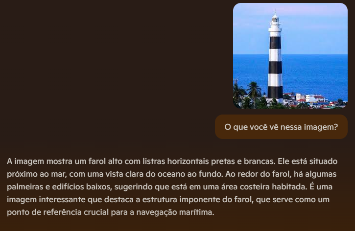
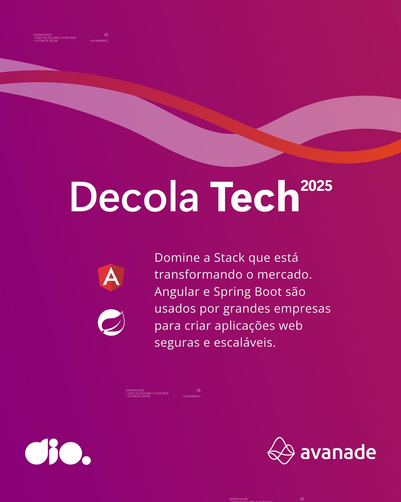
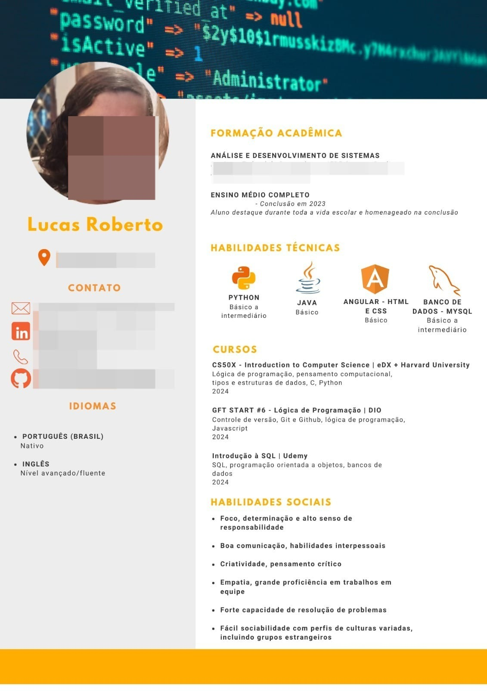

## Reconhecimento de imagens do Microsoft Copilot
Este repositório é um resultado de um desafio de projeto do Bootcamp Decola Tech 2025, no curso de IA generativa redigido por [Valéria Baptista](https://www.linkedin.com/in/valeriabaptista/), visando testar as capacidades do Microsoft Copilot, o chatbot de IA generativa da Microsoft baseado no modelo GPT-4. Foram enviadas imagens, e elas tiveram os seus textos e conteúdos analisados e descritos pela IA.

### Processo
É possível fazer o upload de arquivos como imagens para a IA, no [site oficial do Copilot](https://copilot.microsoft.com/). Dependendo das instruções dadas (prompt), a IA pode realizar tarefas variadas com o conteúdo analisado por ela.

### Resultados
Foram enviadas 3 imagens à IA, e seus conteúdos foram analisados e descritos, especialmente os textos presentes nelas.

#### Imagem 1

Como primeira imagem foi utilizado um letreiro na praça do Marco Zero, um importante ponto turístico na cidade de Recife. O texto obtido foi o seguinte:

>A imagem mostra uma escultura colorida com a palavra "RECIFE" em letras grandes e estilizadas. Cada letra é decorada com diferentes desenhos e cores vibrantes. A escultura está localizada em uma área aberta, próxima a um corpo d'água, com um céu azul claro ao fundo.`
>
>No lado esquerdo da imagem, há um banco e uma placa informativa. A letra "R" tem desenhos de corações e frases em amarelo. A letra "E" é decorada com padrões geométricos coloridos. A letra "C" tem um fundo rosa com desenhos de flores e corações. A letra "I" apresenta ilustrações de pessoas e um sol. A letra "F" tem desenhos de peixes e um fundo azul. A última letra "E" tem ilustrações de olhos e prédios.
>
>A escultura é uma bela representação da cidade de Recife e é um ponto turístico popular, destacando a cultura e a arte local.

Percebe-se que, apesar da IA não ter conseguido identificar os detalhes mais específicos de cada uma das letras, ela as descreveu da forma que ela pôde analisar. Além disso, pode se notar a naturalidade da fala da IA.

#### Imagem 2

Como segunda imagem, foi utilizado uma imagem de um _post_ no Instagram, detalhando algumas das tecnologias presentes no Bootcamp Decola Tech 2025. O texto abstraído foi o seguinte:

>O texto na imagem é o seguinte:
>
>---
>
>**Decola Tech 2025**
>
>Domine a Stack que está transformando o mercado. Angular e Spring Boot são usados por grandes empresas para criar aplicações web seguras e escaláveis.
>
>---
>
>A imagem também contém os logotipos do Angular e do Spring Boot, além dos logotipos da DIO e da Avanade.

É interessante perceber que a IA consegue corretamente diferenciar textos comuns de títulos ou logotipos. Também nota-se que a IA prioriza a utilização de elementos do formato de texto Markdown em suas respostas, como títulos e linhas horizontais (`---`).

#### Imagem 3

Na imagem 3, foi utilizada uma captura de tela do meu currículo, ocultando informações pessoais como cidade, endereço de e-mail e número de telefone. Essa foi a análise obtida:

> O texto na imagem é um currículo de uma pessoa chamada Lucas Roberto. O currículo está dividido em várias seções, incluindo:
>
>1. **Formação Acadêmica**: 
>   - Curso de Análise e Desenvolvimento de Sistemas 
>   - Conclusão do Ensino Médio em 2023
>
>2. **Habilidades Técnicas**:
>   - Python (básico a intermediário)
>   - Java (básico)
>   - Angular - HTML e CSS (básico)
>   - Banco de Dados - MySQL (básico a intermediário)
>
>3. **Cursos**: 
>   - CS50X - Introduction to Computer Science (edX e Harvard University)
>   - GFT START #6 - Lógica de Programação (DIO)
>   - Introdução a SQL (Udemy)
>   - Todos com conclusão prevista para 2024
>
>4. **Habilidades Sociais**:
>   - Foco
>   - Determinação
>   - Boa comunicação
>   - Criatividade
>   - Empatia
>   - Capacidade de resolução de problemas
>   - Facilidade de socialização
>
>5. **Idiomas**: 
>   - Português (Brasil) nativo
>   - Inglês nível avançado/fluente
>
>Além disso, a imagem contém informações de contato e links para perfis em redes sociais profissionais.

Apesar de uma quantidade maior de texto, a IA não teve dificuldades em analisá-lo, mostrando corretamente todas as informações.

### Conclusão
A ferramenta do Copilot é poderosa e eficiente, podendo ser útil nas mais diversas aplicações, como para leitores de tela para pessoas com deficiências visuais, catalogação em massa de elementos de um banco de imagens, ou até abstrações de dados em documentos físicos.
